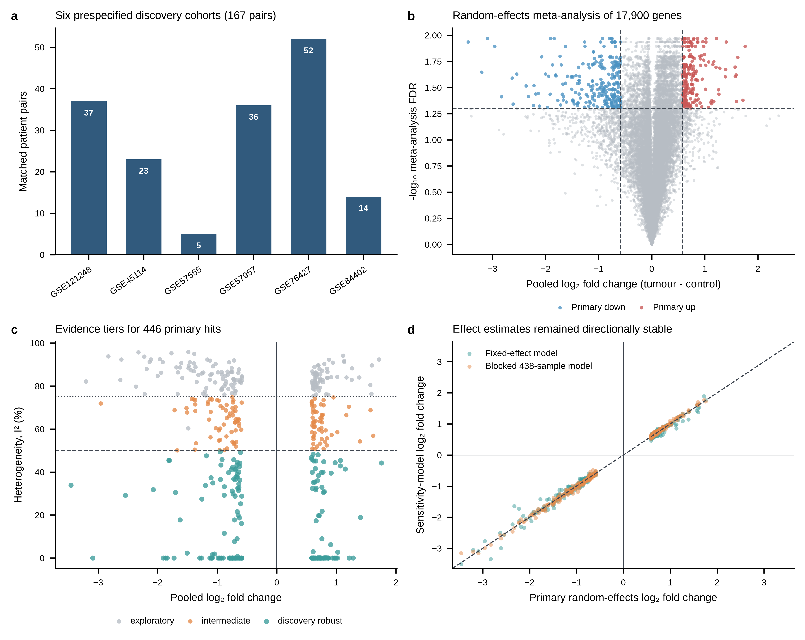
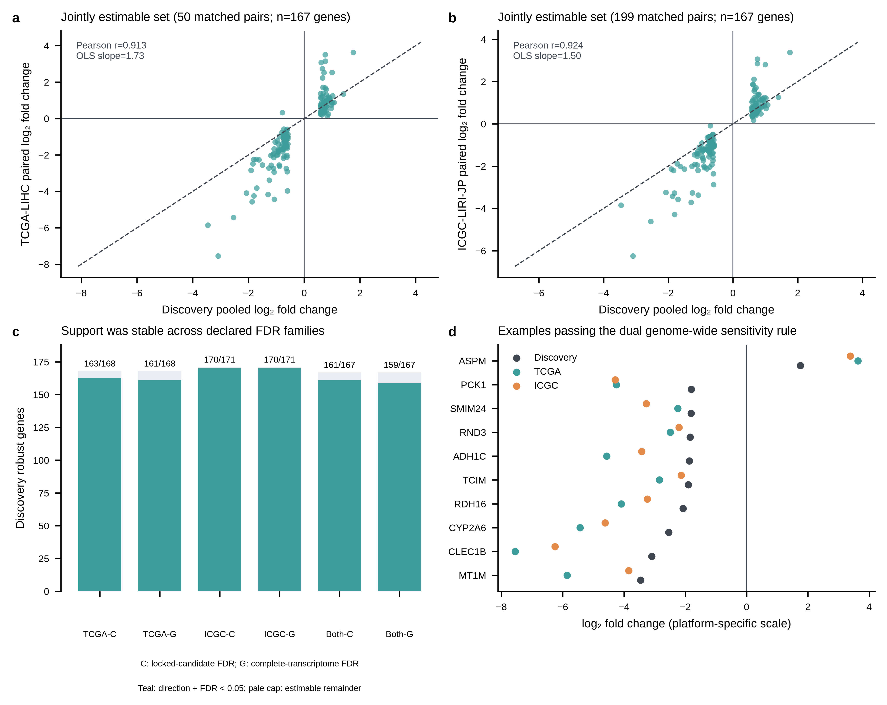

# Paired-cohort meta-analysis with dual RNA-seq replication of recurrent transcriptional alterations in hepatocellular carcinoma

**Article type:** Research article

**Running title:** Recurrent HCC transcriptional alterations

**Authors:** Simiao Yu^1; Zhouping Wang^1*

**Affiliation:** ^1 State Key Laboratory of Food Science and Resources, School of Food Science and Technology, Jiangnan University, No. 1800 Lihu Avenue, Binhu District, Wuxi, Jiangsu 214122, China

**Corresponding author:** Zhouping Wang; wangzp@jiangnan.edu.cn; +86-510-85326195

**Clinical trial number:** not applicable.

## Abstract

**Background:** Cross-study transcriptomic replication can be overstated when patient pairing, platform-specific preprocessing, gene-identifier loss and multiple-testing denominators are handled inconsistently. We sought hepatocellular carcinoma (HCC) tumour-associated changes that remained interpretable across paired cohorts under a prespecified, auditable analysis.

**Methods:** Six Gene Expression Omnibus cohorts were processed within platform. After quality control, 167 matched tumour–non-tumour pairs were analysed with patient-adjusted limma models. Effects for 17,900 genes were synthesized by restricted-maximum-likelihood random-effects meta-analysis with Hartung–Knapp inference. A locked rule yielded 446 recurrent changes, including a 173-gene discovery robust set. Paired RNA-sequencing validation used TCGA-LIHC (50 pairs) and ICGC-LIRI-JP (199 pairs). A post hoc, effect-blinded audit linked current symbols to historical ICGC identifiers. Candidate-family FDR defined locked-list replication; complete-transcriptome FDR was a stricter sensitivity analysis.

**Results:** TCGA and harmonized ICGC analyses jointly estimated 167/173 discovery robust genes. Of these, 166 retained direction in both cohorts, 161 met the dual candidate-family FDR criterion, and 159 met the dual complete-transcriptome criterion. Discovery effects correlated with TCGA (r=0.913) and ICGC (r=0.924) effects. Single-cell data localized transcripts across epithelial, immune and stromal compartments but were not used for differential replication.

**Conclusions:** The paired, platform-aware workflow separated recurrent HCC expression changes from technical non-estimability and testing-family effects. Rather than proposing a new molecular mechanism, it provides an auditable cross-platform evidence map for prioritizing tumour-associated signals while preserving their tissue-level and non-clinical boundaries.

**Keywords:** hepatocellular carcinoma; transcriptomics; paired analysis; meta-analysis; RNA sequencing; reproducibility; bioinformatics

## 1. Introduction

Primary liver cancer remains a major global health burden. Recent estimates attributed more than 830,000 deaths to primary liver cancer in 2020, with the burden expected to increase over the next two decades [1]. Hepatocellular carcinoma (HCC) accounts for most primary liver cancers and arises on a background that may include viral hepatitis, metabolic disease, alcohol-related injury and cirrhosis [2,3]. These aetiologies, together with ancestry, stage and treatment history, shape the molecular state of a tumour. Genomic and transcriptomic studies have consequently described several HCC subclasses rather than one uniform disease programme [4–8]. The biological diversity is real, but it creates a practical problem for public-data analysis: a gene that appears recurrently altered may reflect tumour cells, altered abundance of hepatocytes or immune cells, the field effect in adjacent liver, or a mixture of these processes.

Bulk expression studies are particularly sensitive to this distinction. A tumour-versus-non-tumour contrast is a tissue-level estimand, not a direct readout of a malignant cell. It also depends on how a cohort was sampled and how its platform was normalized. Public studies use different microarray chemistries, probe annotations and sample conventions; RNA-sequencing resources add differences in library preparation, gene identifiers and filtering. If these data are simply pooled, technical differences can be mistaken for biological variation. Conversely, if a gene list is selected in one cohort and then checked in overlapping resources, the apparent validation rate can be difficult to interpret because the discovery threshold, candidate denominator and multiplicity family may have changed after the results were seen.

Meta-analysis offers a way to preserve, rather than hide, these sources of uncertainty. Study-level effects can be estimated on each native platform and then synthesized while retaining between-cohort heterogeneity [9,10]. Earlier integration of 15 HCC datasets identified a 935-gene core signature and established that recurrent tumour–surrounding-liver programmes can be recovered across platforms [25]. The unresolved issue is not whether such recurrence exists, but how much survives patient pairing, explicit heterogeneity criteria, locked robustness checks and independent paired RNA-sequencing validation without changing the testing family.

Pairing tumour with matched non-tumour tissue changes the estimand: the comparison is made within a patient, reducing baseline variation without claiming that adjacent liver is healthy liver. A robust analysis therefore needs more than a large gene list. It needs a frozen sample rule, a visible quality-control record, a predeclared effect threshold, leave-one-cohort-out checks, and an external validation analysis whose multiplicity family and identifier mapping are stated explicitly.

Here, we reanalysed six GEO cohorts using that design. The discovery analysis was locked before external datasets were inspected. Candidate tiers were defined from the discovery evidence and were not promoted by external performance. We then recalculated the external validation with a complete filtered transcriptome denominator in each RNA-sequencing cohort. This provides two complementary answers: a locked-family test asks whether the preselected candidates replicate, whereas a genome-wide test asks whether the same result remains significant under a broader and more conservative correction. Single-cell data were retained as descriptive localization, not as a third differential-expression discovery screen. The objective was to produce an auditable HCC tumour–non-tumour expression resource and to state precisely what it does—and does not—support.

## 2. Materials and methods

### 2.1 Study design and analysis provenance

The discovery plan was frozen before formal differential analysis on 16 September 2026. It specified the six GEO cohorts, tumour-minus-control direction, paired primary model, platform-specific preprocessing, random-effects meta-analysis, robustness analyses and confidence-tier rules. The resulting discovery robust (173 genes) and intermediate (119 genes) sets were read-only inputs to external validation. After the initial external results had been inspected, two post hoc technical audits were specified: FDR was recalculated over each complete filtered transcriptome, and current candidate symbols were reconciled with historical symbols in the ICGC matrix. Neither audit altered discovery samples, candidate membership, effect direction, external cohorts, model specification or significance thresholds.

### 2.2 Discovery cohorts, pairing and preprocessing

The discovery studies were GSE121248, GSE45114, GSE57555, GSE57957, GSE76427 and GSE84402, accessed through the NCBI Gene Expression Omnibus [11]. The intent-to-analyse set contained 439 samples. Raw or non-normalized files were processed according to the frozen platform hierarchy: GPL570 CEL files by robust multi-array average [12]; GPL5918 two-colour GPR files by reading the aligned GenePix feature blocks, applying normexp background correction with an offset of 50 to the 635-nm and 532-nm channels, and applying within-array loess normalization, with M values defined as log2(red/green) ratios for paired comparisons [13]; GPL16699 feature-extraction intensities by log2 transformation and quantile normalization; and GPL10558 non-normalized series data by an auditable within-cohort background, log2 and quantile-compatible workflow informed by the lumi framework [14]. Cross-cohort batch correction was not used for inference.

Probe annotation was performed within platform. Only probes mapping uniquely to one human Entrez Gene identifier in the locked annotation were retained; multiple eligible probes for one gene were averaged after normalization. A gene required finite values in at least 80% of primary samples within a cohort. GSE57555 analyses excluded microRNA-platform samples and cholangiocarcinoma samples. The primary contrast was tumour minus matched non-tumour tissue from the same patient.

### 2.3 Quality control and exclusions

Sample identity, species, tissue class, platform and pairing were checked before modelling. An exclusion required corruption, incorrect identity, or concurrent failure of at least two independent platform-appropriate quality metrics. Principal-component position alone was not an exclusion rule. One GSE57957 control sample (GSM1398656) failed both sample-correlation and detection-rate criteria (robust z scores −4.223 and −6.660). Its complete pair was removed before differential analysis, leaving 438 quality-controlled samples and 167 complete pairs. The excluded sample and the reason for exclusion remain in the audit manifest.

### 2.4 Cohort models and discovery meta-analysis

Each cohort was modelled separately with limma 3.62.1 [15]. The design contained patient fixed effects and tissue class; the coefficient of interest was tumour minus control. Empirical-Bayes moderation was applied to standard errors. Cohort-level significance did not determine entry into the meta-analysis.

For genes represented in at least four cohorts, log2 fold changes and moderated standard errors were combined with `metafor` 5.0-1 [16]. The primary model was `rma.uni(yi = log2FC, sei = SE, method = "REML", test = "knha")`, with between-cohort variance estimated by REML and Hartung–Knapp inference applied to the pooled test [17]. Prediction intervals were obtained from the fitted model using `predict()`. We retained pooled effects, 95% confidence intervals, 95% prediction intervals, tau-squared, I-squared and Cochran’s Q. Benjamini–Hochberg FDR was calculated with `p.adjust(..., method = "BH")` across the complete discovery universe of 17,900 successfully fitted genes; genes with failed fits were retained in the failure table and were not silently treated as null results [18]. In Figure 1b, the upper horizontal band represents tied BH-adjusted values produced by the step-up correction of the Hartung–Knapp P-value distribution with four to six contributing cohorts; the axis was not capped. A discovery hit required FDR <0.05, an absolute pooled log2 fold change ≥0.5849625 (1.5-fold), and directional agreement in at least 75% of contributing cohorts.

### 2.5 Robustness and discovery tiers

Leave-one-cohort-out (LOCO) analyses were repeated over each complete estimable gene universe, with FDR recalculated in each round. A fixed-effect estimate was a comparison only. A secondary blocked analysis used all 438 quality-controlled samples with patient blocking within cohort before random-effects synthesis. Affymetrix-only, Illumina-only and adjacent-non-tumour-only analyses were treated as effect-stability checks; because these subsets contained fewer than four cohorts, they could not create new primary hits.

The 446 discovery hits were retained without external re-selection. A gene entered the discovery robust tier when it passed the primary rule, retained direction in LOCO, fixed-effect and blocked analyses, had I-squared <50%, had a prediction interval excluding zero, and had no unresolved numerical warning, optimizer substitution or model failure. Directionally stable genes that missed one or more of these requirements entered the intermediate tier unless a prespecified exploratory rule applied. The final discovery tiers were 173 discovery robust, 119 intermediate and 154 exploratory genes.

### 2.6 External RNA-sequencing validation and multiplicity reconstruction

TCGA-LIHC STAR-count data were obtained through the UCSC Xena GDC hub [6]. The Xena matrix was released on a log2(STAR count + 1) scale; values were reverse-transformed to the corresponding non-negative integer count scale before filtering and TMM normalization. These are reconstructed counts, not newly generated raw reads. Fifty primary tumour–solid-tissue-normal pairs were matched by patient barcode. ICGC-LIRI-JP Release 28 count data were obtained from the ICGC open object store; 199 donor-matched tumour–non-tumour pairs were retained [19]. The ICGC reference group comprised 194 “normal—solid tissue” samples and five “normal—tissue adjacent to primary” samples; these categories are kept separate in the manifest and are not described as uniformly healthy liver. Duplicate aliquots were resolved using the frozen manifest. Counts were filtered across the complete mapped matrix, normalized by trimmed mean of M values, and analysed with limma–voom using patient or donor fixed effects and tissue class [20,21]. Genes absent from or removed by filtering in the released matrix were recorded as not estimable.

For every locked candidate, external validation reported the nominal P value, FDR within the locked evidence tier (candidate-family FDR), and FDR across the complete filtered transcriptome of that cohort (genome-wide FDR). Candidate-family FDR was calculated separately within each locked evidence tier among estimable genes and was the locked-list replication criterion. Genome-wide FDR was calculated across every finite fitted P value in the complete cohort-specific `filterByExpr` universe; it was added post hoc as a stricter sensitivity analysis and was not treated as statistically equivalent to the discovery FDR because the filtered gene universes differed. Missing, absent and low-expression features were retained as explicit non-estimable states and did not enter either BH family. A validated direction required the external effect to have the same sign as the discovery effect. No candidate was promoted or removed because of external performance. An accession-level audit found no identical released sample identifiers between the GEO discovery cohorts and either TCGA-LIHC or ICGC-LIRI-JP; de-identified patient identity cannot be linked across these repository namespaces.

The frozen ICGC count matrix used historical RefSeq-style symbols. An identifier audit, conducted without inspecting mapped effects, linked current candidate symbols to one historical matrix symbol using Entrez IDs and `org.Hs.eg.db` aliases. Thirty-four discovery robust genes were recovered in this way. The existing fitted ICGC transcriptome rows were reused; therefore, the paired model and the 19,353-gene genome-wide BH family were unchanged. Candidate-family FDR was recalculated after harmonization. The original symbol-only analysis was retained as a sensitivity result.

The complete filtered transcriptome contained 15,657 genes in TCGA and 19,353 genes in ICGC. For the 173-gene discovery robust tier, we reported estimability, directional agreement, candidate-family FDR support and genome-wide FDR support, separately for each cohort and for the intersection of genes jointly estimable in both cohorts. Denominators were never silently reduced after viewing the results.

### 2.7 Descriptive single-cell localization

GSE202642 was used only to describe the cellular distribution of locked transcripts [22]. After cell-level quality control, 97,255 cells from 11 tissue samples (seven tumours and four adjacent tissues) remained. Counts were library-size normalized and log transformed. Broad cell classes were assigned by marker scores. Dominant localization was summarized by the highest mean expression among classes with at least 50 cells. Because only seven tumour and four adjacent tissue samples were available, the dataset was not used for cell-class differential replication. Cells were not treated as independent biological replicates.

### 2.8 Software and reproducibility

The principal R environment used R 4.4.3, limma 3.62.1, edgeR 4.4.0, metafor 5.0-1 and data.table 1.18.6.1. Complete manifests, environment locks, R session information, analysis scripts, source tables and SHA-256 files were retained following reproducible and FAIR research principles [29,30]. Figures were generated from indexed source tables with Python and exported as editable PDF and SVG, 300-dpi PNG and 600-dpi TIFF. Automated verification checked candidate-lock hashes, multiplicity denominators and identifier-harmonization counts.

## 3. Results

### 3.1 The frozen discovery analysis identified 446 recurrent tumour-associated changes

The six cohorts contributed 439 intent-to-analyse samples. After the predeclared quality-control rule, the single exclusion was GSM1398656 from GSE57957 and its complete pair. The primary analysis therefore contained 167 matched pairs: 37, 23, 5, 36, 52 and 14 pairs in GSE121248, GSE45114, GSE57555, GSE57957, GSE76427 and GSE84402, respectively (Fig. 1a).

Across the platform-specific analyses, 17,900 genes had finite effects and positive standard errors in at least four cohorts. The frozen random-effects criteria identified 446 recurrent changes: 198 higher and 248 lower in tumour tissue. Representative pooled effects included CLEC1B (log2FC −3.09, 95% CI −3.27 to −2.91), TCIM (−1.91, −2.10 to −1.71), RND3 (−1.84, −1.96 to −1.72) and IGF2BP3 (1.22, 1.08 to 1.35). These are recurrent tissue-level contrasts, not causal assignments (Fig. 1b).

### 3.2 Robustness separated a discovery robust set from lower-confidence evidence

All 446 hits retained their direction in the six LOCO analyses, in the fixed-effect comparison and in the blocked analysis using all 438 quality-controlled samples. Fixed- and random-effects estimates were highly correlated (Pearson r=0.997), as were the blocked and primary estimates (r=0.999). Complete primary criteria were not expected to be met in every LOCO round because FDR was recalculated over the full gene universe each time; this was not interpreted as a direction reversal.

The platform and control-definition checks retained the direction of all 446 hits. Their effect correlations with the primary estimates were 0.985 for Affymetrix-only, 0.987 for Illumina-only and 0.994 for the adjacent-non-tumour-only analysis. These restricted analyses were used to assess stability, not to enlarge the discovery set. Applying the locked downgrade rules produced 173 discovery robust genes, 119 intermediate genes and 154 exploratory genes (Fig. 1c,d).

**Figure 1.** Discovery and robustness of paired HCC expression effects. (a) Cohort and pair accounting. (b) Genome-wide discovery effects with representative pooled estimates. The upper horizontal band reflects tied BH-adjusted values generated from Hartung–Knapp P values with four to six contributing cohorts; the y-axis was not truncated. (c) Locked discovery tiers. (d) Direction and effect concordance across prespecified sensitivity analyses. All effects use the tumour-minus-non-tumour direction.

### 3.3 Identifier harmonization and dual external validation defined the replicated subset

The 173 discovery robust genes were read-only inputs to the external analyses. TCGA-LIHC contained 50 paired patients. Of the 173 genes, 168 were estimable; 167/168 had the discovery direction, 163/168 passed the candidate-family FDR rule, and 161/168 passed the genome-wide FDR sensitivity rule. ICGC-LIRI-JP contained 199 donor pairs. Identifier harmonization recovered 34 genes recorded under historical symbols, increasing ICGC estimability from 137 to 171 genes. All 171 retained the discovery direction; 170/171 passed both the candidate-family and genome-wide criteria.

After harmonization, 167/173 genes were jointly estimable. Of these, 166/167 retained direction in both datasets. The prespecified candidate-family replication criterion supported 161/167 genes, while the post hoc genome-wide FDR sensitivity analysis supported 159/167. The two multiplicity frameworks therefore changed the dual-cohort count by two genes, indicating that the replicated subset was similar under the two declared denominators rather than dependent on a single correction family. The original symbol-only analysis gave the same qualitative pattern (127/133 candidate-family and 125/133 genome-wide), showing that identifier harmonization chiefly resolved technical missingness. Supplementary Table S1 presents the full evidence ladder with a fixed 173-gene denominator for estimability and an explicit 167-gene denominator for direction and dual-FDR summaries; no denominator was reduced after inspecting the results.

Among the 167 jointly estimable genes, discovery effects correlated with TCGA effects (Pearson r=0.913; OLS slope 1.73, 95% CI 1.61–1.85) and ICGC effects (r=0.924; slope 1.50, 95% CI 1.41–1.60). The slopes above one indicate larger external effect magnitudes on their platform-specific scales, not calibration or stronger biology. Directional proportions and exact Clopper–Pearson confidence intervals are reported descriptively in Supplementary Table S3 because genes are correlated and are not independent replicates (Fig. 2).

The intermediate tier was not used to define the main replicated subset. In the unchanged symbol-based analysis, 98/119 were jointly estimable, all 98 were directionally concordant, and 97/98 passed both FDR criteria. No external result was used to change either discovery tier.

**Figure 2.** Independent paired-cohort validation after ICGC identifier harmonization. (a,b) Discovery effects compared with TCGA-LIHC and ICGC-LIRI-JP paired effects among the same 167 jointly estimable discovery robust genes. Pearson correlations and ordinary least-squares slopes are descriptive platform-scale comparisons. (c) Candidate-family replication and genome-wide sensitivity counts with explicit denominators. (d) Representative effects meeting the dual genome-wide sensitivity rule. Candidate-family and genome-wide analyses answer distinct inferential questions.

### 3.4 Single-cell localization is retained as descriptive supplementary evidence

GSE202642 contained 97,255 quality-controlled cells from 11 tissue samples. Locked transcripts localized across hepatocyte, cholangiocyte, Kupffer/macrophage, fibroblast/cancer-associated fibroblast and other broad compartments (Supplementary Fig. S1). This distribution is compatible with a tissue-level programme assembled from epithelial, immune and stromal components, as reported in other HCC single-cell atlases [26–28]. The dataset was not used as a third differential-expression cohort because it contained only seven tumour and four adjacent tissue samples.

## 4. Discussion

Six paired GEO cohorts yielded 446 recurrent tumour-associated changes, of which 173 met the discovery robustness rules. Without external re-selection, 167 were estimable in both paired RNA-sequencing cohorts after identifier harmonization; 166 retained direction, 161 met the candidate-family replication criterion and 159 met the genome-wide sensitivity criterion. The principal result is therefore not the whole 173-gene tier, but a well-defined replicated subset with explicit technical boundaries.

The computational contribution is an analysis-control design rather than a new estimator. Five common sources of apparent replication were handled in one traceable chain: patient pairing was preserved within cohort; each platform was processed and modelled separately; robustness checks were rerun over complete gene universes; candidate-family and complete-transcriptome multiplicity were reported as different inferential questions; and identifier loss was treated as auditable missingness rather than biological failure. After harmonization, the two external FDR families differed by only two genes (161 versus 159), whereas effect-blinded identifier reconciliation recovered 34 ICGC features recorded under historical symbols. In this dataset, gene-identity handling therefore changed estimability more than the choice between the two stated FDR families. The audit remains labelled post hoc because it followed inspection of the missingness pattern, even though the mapping was fixed without viewing recovered effects.

The study complements rather than replaces earlier HCC compendia. Allain et al. used 15 microarray datasets and identified a 935-gene signature spanning recurrent HCC hallmarks [25]. Thirty-nine of our 173 discovery robust genes overlapped that signature, and all 39 had the same reported direction; among the 167 genes jointly estimable in TCGA and ICGC, 38 overlapped and all 38 agreed in direction (Supplementary Table S4). This is a descriptive comparison, not an independent validation, because study-level overlap between public microarray compendia cannot be excluded. Our narrower contribution is methodological: matched patient contrasts were estimated within platform, heterogeneity and prediction intervals constrained discovery, robustness was assessed over complete gene universes, and two independent paired RNA-sequencing cohorts were analysed with fixed candidate and multiplicity denominators. The smaller replicated set should therefore be read as a stringent recurrence map, not as a claim to a broader or biologically more complete HCC programme.

The paired design also defines the biological scope. A tumour-minus-matched-non-tumour effect controls some person-level variation, but adjacent liver can contain fibrosis, inflammation and field effects [23,24]. The recurrent signal therefore represents a tumour-associated tissue state, not necessarily a tumour-cell-autonomous alteration. Single-cell localization shows that the locked transcripts are distributed among epithelial, immune and stromal compartments, but the small number of independent tissue samples cannot support within-cell-class differential inference.

Several limitations remain. Discovery used four array platforms and platform-specific gene coverage differed. Most samples were surgical tissues, so advanced unresectable disease may be underrepresented. The reference tissue was non-tumour or adjacent liver, not healthy liver; in ICGC, five of the 199 reference samples were annotated as tissue adjacent to the primary tumour. The external datasets are independent at the cohort level but differ in ancestry, collection and count processing. Missing genes in ICGC were recorded as not estimable rather than as failures, which is transparent but reduces the jointly testable denominator. The study did not estimate diagnostic performance, treatment benefit, recurrence prevention, or a prospective clinical risk score. Protein-level measurement and experimental perturbation are also absent.

The practical deliverable is a versioned, auditable evidence map rather than a larger catalogue of HCC genes. The 159 genes meeting the dual genome-wide sensitivity criterion are a defensible starting point for orthogonal measurement, while the 161-gene candidate-family result remains the primary locked-list replication estimate. The accompanying manifests, locked denominators, source tables and verification rules make it possible to reproduce not only the positive calls but also the reasons that individual genes were unmeasured, filtered or downgraded. Future work can test the prioritized genes by targeted RNA or protein assays in clinically annotated, cell-resolved samples. The current data support recurrent tissue-level association and prioritization; they do not establish diagnostic performance, therapeutic benefit or causal mechanism.

## 5. Conclusions

A platform-aware paired-cohort meta-analysis identified recurrent HCC tumour–non-tumour expression changes and separated discovery robustness from external replication. After transparent ICGC identifier harmonization, 167 of 173 discovery robust genes were jointly estimable, 161 met the candidate-family replication criterion, and 159 met the stricter genome-wide sensitivity criterion. The principal contribution is the auditable control of pairing, platform, identifier, denominator and multiplicity decisions across discovery and replication. Single-cell localization provides cellular context without extending the claim to mechanism. The resulting resource is suitable for hypothesis generation and orthogonal validation, not clinical prediction or treatment claims.

## 6. Declarations

### 6.1 Ethics approval and consent to participate

This study reanalysed de-identified public data and involved no new participant recruitment or specimen collection. No additional ethics approval was required for this secondary analysis. Ethical approval and informed-consent procedures for the source cohorts are described in the original publications and repository records.

### 6.2 Consent for publication

Not applicable to this secondary analysis of de-identified public data.

### 6.3 Funding

This work was supported by the National Key Research and Development Program of China (2025YFF1107505), the National Natural Science Foundation of China (32372423 and 32302190), and the Science and Technology Plan Project of Jiangsu Province (BE2022324). The funders had no role in study design, data collection, analysis, interpretation, manuscript preparation or the decision to submit.

### 6.4 Competing interests

The authors declare no competing interests.

### 6.5 Author contributions

Simiao Yu: conceptualization, data curation, formal analysis, methodology, software, visualization and original draft. Zhouping Wang: supervision, conceptualization, methodology, funding acquisition and critical revision. Both authors reviewed and approved the final manuscript and accept responsibility for the work.

### 6.6 Acknowledgements

Not applicable.

### 6.7 Use of language-editing tools

During preparation of this manuscript, the authors used ChatGPT (OpenAI) through Codex to assist with manuscript organization and language editing. The authors reviewed and edited the output, verified the numerical and scientific content, and take full responsibility for the final manuscript.

### 6.8 Data availability

All primary data are available from public repositories: GEO accessions are listed in Section 2.2; TCGA-LIHC was accessed through the UCSC Xena GDC hub; ICGC-LIRI-JP was accessed from Release 28 of the ICGC open object store; and GSE202642 is available through GEO. The Allain comparison used the official Supplementary Table 2 archive (dataset DOI: 10.1158/0008-5472.22412988.v1). Download URLs, versions, access dates and SHA-256 values are recorded in the project manifests. The derived matrices, locked tables, source data, figures, scripts and environment specifications will be supplied to editors and reviewers through a private access package during peer review. If accepted, they will be deposited in a stable public repository before publication and the permanent URL or DOI will be added here. No public DOI is claimed at submission.

### 6.9 Code availability

The complete workflow, including analysis protocols, multiplicity and identifier audits, verification scripts, figure source data and environment lock, is included in the private reviewer package. The public repository URL, release tag and archival DOI will be added before publication if the manuscript is accepted.

## 7. References

1. Rumgay H, Arnold M, Ferlay J, et al. Global burden of primary liver cancer in 2020 and predictions to 2040. J Hepatol. 2022;77:1598–1606. doi:10.1016/j.jhep.2022.08.021.
2. Villanueva A. Hepatocellular carcinoma. N Engl J Med. 2019;380:1450–1462. doi:10.1056/NEJMra1713263.
3. Llovet JM, Kelley RK, Villanueva A, et al. Hepatocellular carcinoma. Nat Rev Dis Primers. 2021;7:6. doi:10.1038/s41572-020-00240-3.
4. Boyault S, Rickman DS, de Reyniès A, et al. Transcriptome classification of HCC is related to gene alterations and to new therapeutic targets. Hepatology. 2007;45:42–52. doi:10.1002/hep.21467.
5. Chiang DY, Villanueva A, Hoshida Y, et al. Focal gains of VEGFA and molecular classification of hepatocellular carcinoma. Cancer Res. 2008;68:6779–6788. doi:10.1158/0008-5472.CAN-08-0742.
6. Cancer Genome Atlas Research Network. Comprehensive and integrative genomic characterization of hepatocellular carcinoma. Cell. 2017;169:1327–1341.e23. doi:10.1016/j.cell.2017.05.046.
7. Hoshida Y, Nijman SMB, Kobayashi M, et al. Integrative transcriptome analysis reveals common molecular subclasses of human hepatocellular carcinoma. Cancer Res. 2009;69:7385–7392. doi:10.1158/0008-5472.CAN-09-1089.
8. Lee JS, Chu IS, Heo J, et al. Classification and prediction of survival in hepatocellular carcinoma by gene expression profiling. Hepatology. 2004;40:667–676. doi:10.1002/hep.20375.
9. Ramasamy A, Mondry A, Holmes CC, Altman DG. Key issues in conducting a meta-analysis of gene expression microarray datasets. PLoS Med. 2008;5:e184. doi:10.1371/journal.pmed.0050184.
10. Tseng GC, Ghosh D, Feingold E. Comprehensive literature review and statistical considerations for microarray meta-analysis. Nucleic Acids Res. 2012;40:3785–3799. doi:10.1093/nar/gkr1265.
11. Barrett T, Wilhite SE, Ledoux P, et al. NCBI GEO: archive for functional genomics data sets, update. Nucleic Acids Res. 2013;41:D991–D995. doi:10.1093/nar/gks1193.
12. Irizarry RA, Hobbs B, Collin F, et al. Exploration, normalization, and summaries of high density oligonucleotide probe level data. Biostatistics. 2003;4:249–264. doi:10.1093/biostatistics/4.2.249.
13. Smyth GK, Speed T. Normalization of cDNA microarray data. Methods. 2003;31:265–273. doi:10.1016/S1046-2023(03)00155-5.
14. Du P, Kibbe WA, Lin SM. lumi: a pipeline for processing Illumina microarray. Bioinformatics. 2008;24:1547–1548. doi:10.1093/bioinformatics/btn224.
15. Ritchie ME, Phipson B, Wu D, et al. limma powers differential expression analyses for RNA-sequencing and microarray studies. Nucleic Acids Res. 2015;43:e47. doi:10.1093/nar/gkv007.
16. Viechtbauer W. Conducting meta-analyses in R with the metafor package. J Stat Softw. 2010;36:1–48. doi:10.18637/jss.v036.i03.
17. Hartung J, Knapp G. On tests of the overall treatment effect in meta-analysis with normally distributed responses. Stat Med. 2001;20:1771–1782. doi:10.1002/sim.791.
18. Benjamini Y, Hochberg Y. Controlling the false discovery rate: a practical and powerful approach to multiple testing. J R Stat Soc Series B. 1995;57:289–300. doi:10.1111/j.2517-6161.1995.tb02031.x.
19. Fujimoto A, Furuta M, Totoki Y, et al. Whole-genome mutational landscape and characterization of noncoding and structural mutations in liver cancer. Nat Genet. 2016;48:500–509. doi:10.1038/ng.3547.
20. Robinson MD, McCarthy DJ, Smyth GK. edgeR: a Bioconductor package for differential expression analysis of digital gene expression data. Bioinformatics. 2010;26:139–140. doi:10.1093/bioinformatics/btp616.
21. Law CW, Chen Y, Shi W, Smyth GK. voom: precision weights unlock linear model analysis tools for RNA-seq read counts. Genome Biol. 2014;15:R29. doi:10.1186/gb-2014-15-2-r29.
22. Zhu GQ, Wang K, Wang B, et al. CD36+ cancer-associated fibroblasts provide an immunosuppressive microenvironment for hepatocellular carcinoma via secretion of macrophage migration inhibitory factor. Cell Discov. 2023;9:25. doi:10.1038/s41421-023-00529-z.
23. Budhu A, Forgues M, Ye QH, et al. Prediction of venous metastases, recurrence, and prognosis in hepatocellular carcinoma based on a unique immune response signature of the liver microenvironment. Cancer Cell. 2006;10:99–111. doi:10.1016/j.ccr.2006.06.016.
24. Hoshida Y, Villanueva A, Kobayashi M, et al. Gene expression in fixed tissues and outcome in hepatocellular carcinoma. N Engl J Med. 2008;359:1995–2004. doi:10.1056/NEJMoa0804525.
25. Allain C, Angenard G, Clément B, Coulouarn C. Integrative genomic analysis identifies the core transcriptional hallmarks of human hepatocellular carcinoma. Cancer Res. 2016;76:6374–6381. doi:10.1158/0008-5472.CAN-16-1559.
26. Ma L, Hernandez MO, Zhao Y, et al. Tumor cell biodiversity drives microenvironmental reprogramming in liver cancer. Cancer Cell. 2019;36:418–430.e6. doi:10.1016/j.ccell.2019.08.007.
27. Sharma A, Seow JJW, Dutertre CA, et al. Onco-fetal reprogramming of endothelial cells drives immunosuppressive macrophages in hepatocellular carcinoma. Cell. 2020;183:377–394.e21. doi:10.1016/j.cell.2020.08.040.
28. Zheng C, Zheng L, Yoo JK, et al. Landscape of infiltrating T cells in liver cancer revealed by single-cell sequencing. Cell. 2017;169:1342–1356.e16. doi:10.1016/j.cell.2017.05.035.
29. Sandve GK, Nekrutenko A, Taylor J, Hovig E. Ten simple rules for reproducible computational research. PLoS Comput Biol. 2013;9:e1003285. doi:10.1371/journal.pcbi.1003285.
30. Wilkinson MD, Dumontier M, Aalbersberg IJ, et al. The FAIR Guiding Principles for scientific data management and stewardship. Sci Data. 2016;3:160018. doi:10.1038/sdata.2016.18.
