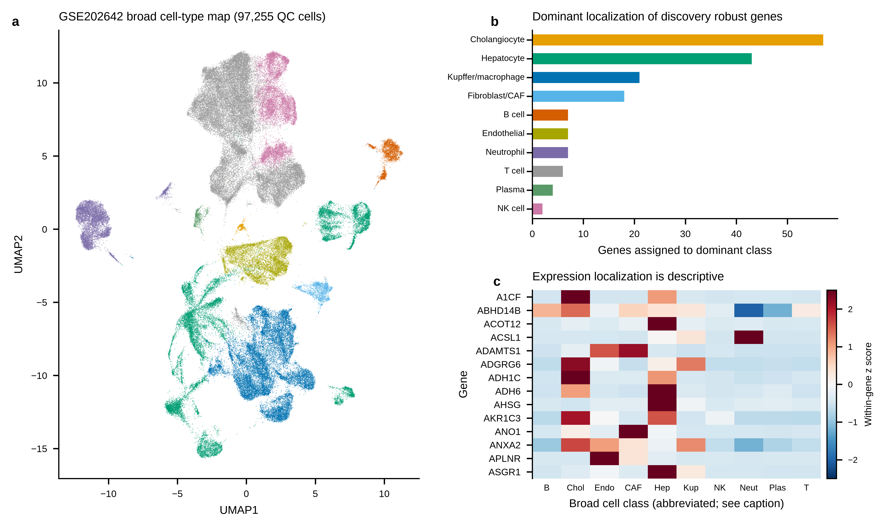

# Supplementary Information

## Supplementary Note 1. External validation, multiplicity and identifier harmonization

The discovery robust set contains 173 genes. External validation used two declared multiplicity families. `candidate_family_FDR` was calculated separately within each locked evidence tier among estimable genes and was the primary locked-list replication criterion. `genomewide_FDR` was calculated with Benjamini–Hochberg correction across every finite fitted P value in the complete cohort-specific `filterByExpr` universe and was added post hoc as a stricter sensitivity analysis. The filtered transcriptomes contained 15,657 genes in TCGA-LIHC and 19,353 genes in ICGC-LIRI-JP. These universes are not identical to the 17,900-gene discovery universe, so the two external FDR measures are reported separately. Absent and low-expression features were retained as explicit non-estimable states and did not enter either multiplicity family.

The frozen ICGC count matrix used historical RefSeq-style symbols. After the initial missingness pattern was inspected, a post hoc technical audit linked current candidate symbols to historical matrix symbols through locked Entrez IDs and `org.Hs.eg.db` aliases. The mapping was frozen without inspecting the recovered expression effects. Thirty-four discovery robust candidates were recovered; the existing fitted ICGC rows and the 19,353-gene genome-wide BH family were unchanged. The original symbol-only results remain available as a sensitivity analysis.

## Supplementary Table S1. External validation counts

| Analysis | Scope | Metric | Numerator | Denominator | Denominator definition |
|---|---|---:|---:|---:|---|
| Main | TCGA-LIHC | Estimable | 168 | 173 | Locked discovery robust set |
| Main | TCGA-LIHC | Same direction | 167 | 168 | Estimable genes |
| Main | TCGA-LIHC | Candidate-family FDR <0.05 and same direction | 163 | 168 | Estimable genes |
| Main | TCGA-LIHC | Genome-wide FDR <0.05 and same direction | 161 | 168 | Estimable genes |
| Identifier-harmonized | ICGC-LIRI-JP | Estimable | 171 | 173 | Locked discovery robust set |
| Identifier-harmonized | ICGC-LIRI-JP | Same direction | 171 | 171 | Estimable genes |
| Identifier-harmonized | ICGC-LIRI-JP | Candidate-family FDR <0.05 and same direction | 170 | 171 | Estimable genes |
| Identifier-harmonized | ICGC-LIRI-JP | Genome-wide FDR <0.05 and same direction | 170 | 171 | Estimable genes |
| Identifier-harmonized | Both cohorts | Jointly estimable | 167 | 173 | Locked discovery robust set |
| Identifier-harmonized | Both cohorts | Same direction in both | 166 | 167 | Jointly estimable genes |
| Identifier-harmonized | Both cohorts | Dual candidate-family FDR <0.05 and same direction | 161 | 167 | Jointly estimable genes |
| Identifier-harmonized | Both cohorts | Dual genome-wide FDR <0.05 and same direction | 159 | 167 | Jointly estimable genes |
| Original symbol-only sensitivity | Both cohorts | Jointly estimable | 133 | 173 | Locked discovery robust set |
| Original symbol-only sensitivity | Both cohorts | Dual candidate-family FDR <0.05 and same direction | 127 | 133 | Jointly estimable genes |
| Original symbol-only sensitivity | Both cohorts | Dual genome-wide FDR <0.05 and same direction | 125 | 133 | Jointly estimable genes |

## Supplementary Table S2. Non-estimability after identifier harmonization

### TCGA-LIHC

Five discovery robust genes were present before filtering but did not meet the complete-matrix expression filter: **IGF2BP3, SRXN1, COX7B2, FAM133A and PAGE4**. The expression filter was not relaxed after these genes were identified. A count-level audit confirmed that all five failed the unchanged cohort-wide `filterByExpr` rule; for example, IGF2BP3 had a median of 3 counts in normal samples and 21.5 counts in tumour samples, with CPM ≥1 in only 17/100 libraries. These genes therefore remain not estimable in TCGA rather than being labelled directionally discordant.

### ICGC-LIRI-JP

Thirty-four candidates absent under their current symbols were recovered under frozen historical symbols. **REXO5** remained absent after harmonization. **COX7B2** was present but removed by the expression filter. The complete mapping table, including current symbol, historical symbol, Entrez ID and mapping basis, is supplied as Source Data.

## Supplementary Table S3. Descriptive external concordance statistics

| Scope | Cohort | Direction | Exact 95% CI | Pearson r | Spearman rho | OLS slope (95% CI) |
|---|---|---:|---:|---:|---:|---:|
| All estimable | TCGA-LIHC | 167/168 | 0.967–1.000 | 0.914 | 0.870 | 1.73 (1.61–1.85) |
| Identifier-harmonized | ICGC-LIRI-JP | 171/171 | 0.979–1.000 | 0.897 | 0.881 | 1.57 (1.46–1.69) |
| Jointly estimable | TCGA-LIHC | 166/167 | 0.967–1.000 | 0.913 | 0.871 | 1.73 (1.61–1.85) |
| Jointly estimable | ICGC-LIRI-JP | 167/167 | 0.978–1.000 | 0.924 | 0.878 | 1.50 (1.41–1.60) |
| Jointly estimable, both cohorts | Both cohorts | 166/167 | 0.967–1.000 | not applicable | not applicable | not applicable |

Direction summaries report proportions and exact Clopper–Pearson 95% confidence intervals. They are descriptive because genes are correlated and the candidate set was selected before this audit; genes are not independent biological replicates. No binomial null test is reported. Ordinary least-squares slopes compare platform-specific effect scales and are not calibration coefficients or causal effects.

## Supplementary Note 2. Descriptive single-cell localization

GSE202642 supplied 115,732 cells from 11 tissue samples. After quality control (minimum 500 counts, 200–6,000 detected features and no more than 20% mitochondrial reads), 97,255 cells remained from seven tumour and four adjacent-tissue samples. Ten broad classes were retained: B cell, cholangiocyte, endothelial, fibroblast/cancer-associated fibroblast, hepatocyte, Kupffer/macrophage, NK cell, neutrophil, plasma cell and T cell.

Of the 292 locked discovery robust and intermediate genes, 291 were detected. Among the 173 discovery robust genes, the dominant broad classes were cholangiocyte (57), hepatocyte (43), Kupffer/macrophage (21), fibroblast/CAF (18), endothelial (7), B cell (7), neutrophil (7), T cell (6), plasma cell (4) and NK cell (2). These assignments are descriptive and are based on broad-class mean expression. An exploratory sample-level tumour-versus-adjacent comparison was performed, but the seven-versus-four design was insufficient for reliable inference. Its direction counts were therefore not retained as evidence or reported as differential validation; cells were not treated as independent samples.

**Supplementary Figure S1.** (a) Broad cell classes among 97,255 quality-controlled cells. (b) Dominant localization of discovery robust genes. (c) Example expression localization heat map. Localization is descriptive and is not an independent differential-expression validation. Heat-map abbreviations are: B, B cell; Chol, cholangiocyte; Endo, endothelial; CAF, fibroblast/cancer-associated fibroblast; Hep, hepatocyte; Kup, Kupffer/macrophage; NK, natural killer cell; Neut, neutrophil; Plas, plasma cell; and T, T cell.

## Supplementary Table S4. Descriptive comparison with the Allain et al. 935-gene signature

| Current analysis set | Current denominator | Allain denominator | Overlap | Same direction among overlapping genes |
|---|---:|---:|---:|---:|
| Discovery robust | 173 | 935 | 39 | 39/39 |
| Jointly estimable in TCGA and ICGC | 167 | 935 | 38 | 38/38 |

The comparison used the official Allain et al. Supplementary Table 2 archive (dataset DOI: 10.1158/0008-5472.22412988.v1). It is descriptive and is not counted as independent validation because study-level overlap between public microarray compendia cannot be excluded. No overlap-enrichment or direction-null P value was calculated.

## Supplementary Table S5. Evidence disposition

| Endpoint | Available result | Interpretation | Manuscript use |
|---|---|---|---|
| Six-cohort paired meta-analysis | 446 discovery hits; 173 discovery robust | Primary discovery evidence | Main text and Figure 1 |
| TCGA-LIHC paired RNA-seq | 168/173 estimable | Independent external expression test | Main text and Figure 2 |
| ICGC-LIRI-JP paired RNA-seq | 171/173 estimable after identifier harmonization | Independent external expression test; mapping audit disclosed as post hoc | Main text and Figure 2 |
| GSE202642 single-cell | 97,255 cells from 11 tissue samples | Descriptive cellular localization only | Supplementary Figure S1 |

## Supplementary Table S6. Diagnostic audit of denominators and identifier handling

| Audit stage | Estimable or retained numerator | Denominator | What changed | Interpretation |
|---|---:|---:|---|---|
| Locked discovery robust tier | 173 | 173 | None | Discovery denominator fixed before external validation |
| TCGA-LIHC after complete-matrix filtering | 168 | 173 | Five candidates not estimable after filtering | Technical coverage loss, not direction failure |
| ICGC-LIRI-JP before identifier harmonization | 137 | 173 | Historical symbols were not matched | Symbol-level missingness |
| ICGC-LIRI-JP after effect-blinded identifier harmonization | 171 | 173 | 34 candidates recovered; one remained absent and one was filtered | Improved estimability without changing the fitted transcriptome or thresholds |
| Both external cohorts, jointly estimable before harmonization | 133 | 173 | Intersection of the two original symbol-level denominators | Historical-symbol loss carried into the joint denominator |
| Both external cohorts, jointly estimable after harmonization | 167 | 173 | Identifier recovery increased the joint denominator by 34 | Fixed denominator used for direction and dual-FDR summaries |
| Both cohorts, same direction | 166 | 167 | One jointly estimable gene was discordant | Directional agreement among jointly estimable genes |
| Both cohorts, candidate-family FDR | 161 | 167 | Locked-tier BH within each external cohort | Primary replication criterion |
| Both cohorts, complete-transcriptome FDR | 159 | 167 | BH across the full filtered transcriptome in each cohort | Post hoc stricter sensitivity analysis |

This table is a diagnostic reconstruction of the reported evidence ladder, not a new candidate-selection procedure. The underlying row-level files are supplied in `results/validation/cbc_external_validation_v1/identifier_harmonization_counts.tsv` and `results/validation/cbc_external_validation_v1/tcga_icgc_identifier_harmonized_sensitivity.tsv`. The 173-gene locked denominator was not changed after external results were inspected.
